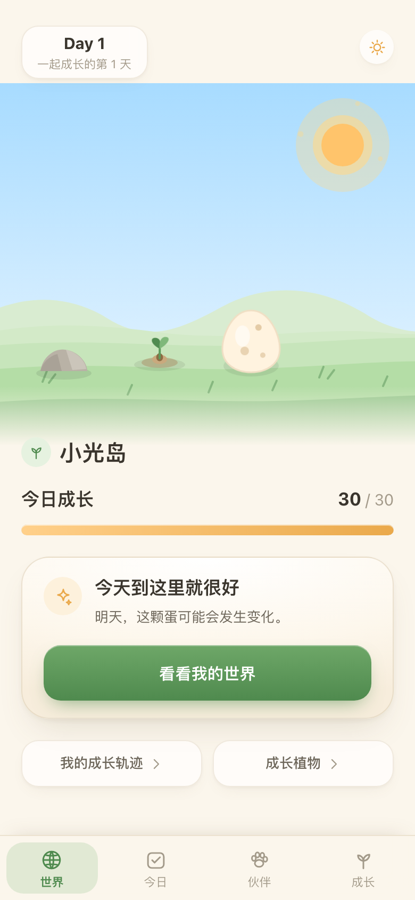
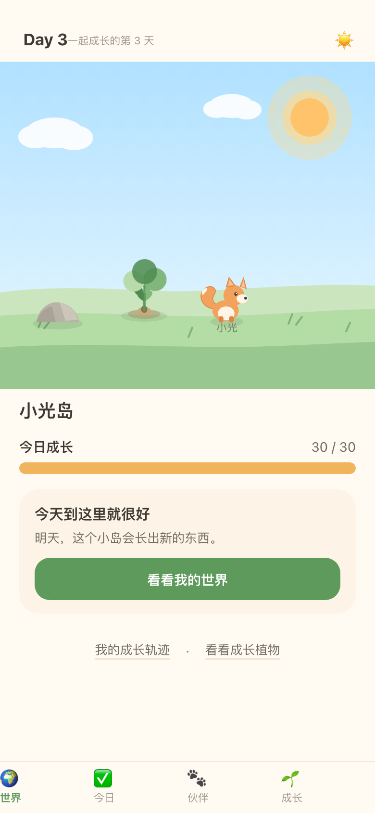
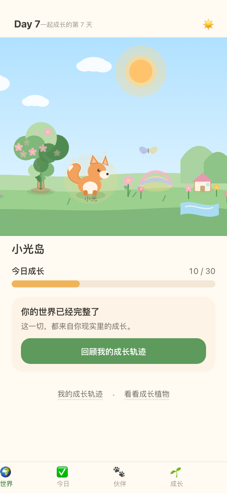
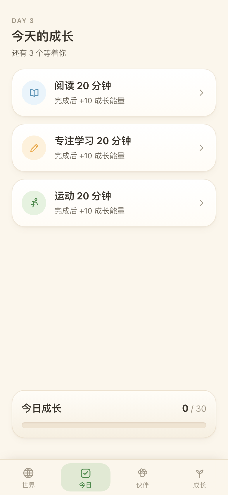
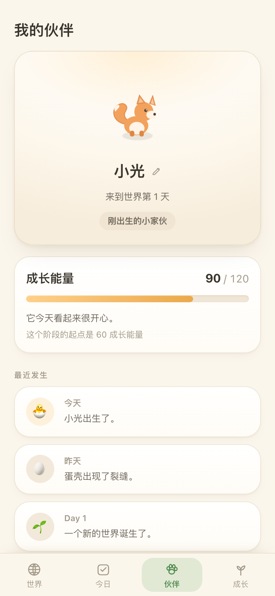
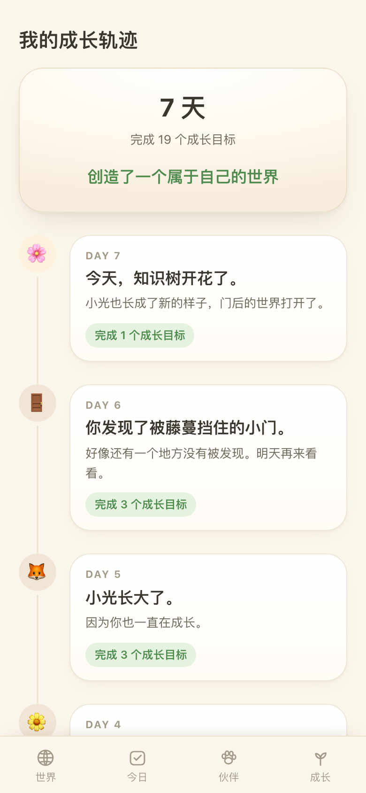

# 7 天学生成长世界 · Phase 0 Prototype

验证一个核心闭环：

```text
选择现实目标 → 完成目标 → 获得成长能量 → 宠物 / 植物 / 世界发生变化
→ 产生期待 → 第二天主动回来
```

Phase 0 **不做**：登录注册、后端、AI、社交、排行榜、商城、金币、付费、老师端、家长后台。
所有数据保存在 `localStorage`。

## 开发流程（PR）

> **不要在 `main` 上直接提交。** 任何改动都走分支 + PR。
> `main` 就是线上（Vercel 自动部署），PR 也是唯一会强制跑检查的地方。

`main` 上的每个提交都来自一个 pull request，用 **squash merge** —— 所以 PR 标题就是
commit subject，这也是唯一强制检查的格式。

```bash
git switch -c feat/goal-library
# ...改代码...
pnpm verify && pnpm e2e        # 本地先过一遍
git push -u origin feat/goal-library
gh pr create --fill            # 模板会自动带上
```

开 PR 后自动跑两套：

| workflow | 检查 |
| --- | --- |
| `ci.yml` | 格式 · 类型 · lint · 单测 · 构建 · Playwright |
| `pr.yml` | PR 标题符合 `<type>(<scope>): <subject>` |

标题规则本地也能跑：

```bash
./scripts/check-pr-title.sh "feat(goals): split learning by subject"
```

**PR 模板里的「纪律检查」不是走过场** —— 它把 spec 与 `AGENTS.md` 的硬约束
（analytics schema 固定 14 个事件、不采集真实身份、目标库文案规则、P4 禁用词、
Day Gate、`data-testid`）变成提交前必须逐条确认的清单。这个项目的最大风险是
范围蔓延，模板第一段就是用来挡它的。

### 分支保护（已开启）

CI 已经是真正的门而不是提示。`main` 现在受保护：直接 push 会被拒绝，
必须走 PR 且三个检查全绿才能合并。

实测直接 push 的返回：

```text
remote: error: GH006: Protected branch update failed for refs/heads/main.
remote: - Changes must be made through a pull request.
remote: - 3 of 3 required status checks are expected.
```

配置用下面这条命令应用（`enforce_admins=true`，管理员同样绕不过）：

```bash
gh api -X PUT repos/linonward/growth/branches/main/protection \
  -F required_status_checks[strict]=true \
  -F 'required_status_checks[contexts][]=Format, types, lint, unit tests, build' \
  -F 'required_status_checks[contexts][]=End-to-end (mobile chromium)' \
  -F 'required_status_checks[contexts][]=PR title convention' \
  -F enforce_admins=false \
  -F 'required_pull_request_reviews[required_approving_review_count]=0' \
  -F restrictions=
```

`required_approving_review_count=0` 是刻意的：单人项目不需要为了凑一个 approval
而制造虚假评审，但**必须**让检查通过才能合并。

`enforce_admins=true` 也是刻意的 —— 仓库只有一个人，`false` 会让这条规则对唯一
的使用者失效，等于没开。

**紧急出口**（CI 挂了但必须发版）：`gh api -X DELETE repos/linonward/growth/branches/main/protection`
临时关闭，处理完立刻用上面的命令恢复。

## 持续集成

`.github/workflows/ci.yml`，两个 job：

| job | 内容 |
| --- | --- |
| `verify` | `check:ci` · `typecheck` · `lint` · `test` · `build` |
| `e2e` | Playwright（mobile chromium），失败时上传 trace |

两个刻意的选择：

- **不注入 `NEXT_PUBLIC_POSTHOG_KEY`** —— 让 CI 负责守住「没有 key 也必须能构建、
  能跑」这条规则。实测无 key 时欢迎页、选目标、导出全部正常，本地日志照常记录，
  只有 0 个请求发往 PostHog（见 AGENTS.md 的 Analytics 约束）。
- **`check:ci` 而不是 `check`** —— 前者只读，格式漂移会失败而不是被悄悄改掉。

> CI 头两次跑都挂了，抓到的都是**本地树会掩盖的可移植性问题**：
> `typecheck` 依赖 `.next`（已改为先跑 `next typegen`），
> 以及「时段异常」用了分析机器的时区而不是孩子的（已随导出记录 offset）。
> 这类问题只有干净环境才暴露得出来。

## 相关文档

| 文档 | 内容 |
| --- | --- |
| [`AGENTS.md`](AGENTS.md) | 架构约束与容易踩的坑（改代码前先看） |
| [`docs/competitive-positioning.md`](docs/competitive-positioning.md) | 竞品对比、差异化、以及自评失真的验证设计 |

---

## 快速开始

```bash
pnpm install
pnpm dev          # http://localhost:3000
```

> 请使用 `localhost` 而不是 `127.0.0.1` 打开，否则 Next 16 会拦截 dev 资源。
> 已在 `next.config.ts` 中通过 `allowedDevOrigins` 放行这两个 host。

### 常用命令

| 命令 | 说明 |
| --- | --- |
| `pnpm dev` | 开发服务器 |
| `pnpm build` / `pnpm start` | 生产构建 / 启动 |
| `pnpm format` | Biome 格式化并写回 |
| `pnpm format:check` | 只检查格式（CI 用） |
| `pnpm check` | 格式化 + 整理 import |
| `pnpm check:ci` | 只检查，不写回 |
| `pnpm test` | Vitest 单元测试（domain + store，103 个） |
| `pnpm e2e` | Playwright 端到端测试（11 个，含完整 7 天流程） |
| `pnpm typecheck` | TypeScript 检查 |
| `pnpm lint` | ESLint |
| `pnpm verify` | check:ci + typecheck + lint + test + build |

### 代码格式

格式化用 **Biome**，lint 用 **ESLint** —— 两者职责不重叠：

- `biome.json` 里 `linter.enabled: false`，避免同一问题被两个工具重复报错
  （`eslint-config-next` 已覆盖 Next/React 规则）。
- Biome 负责：格式化 + 整理 import（assist）。
- 缩进 2 空格、双引号、分号、行宽 90，与现有代码风格一致。
- `globals.css` 需要 `css.parser.tailwindDirectives: true` 才能解析 Tailwind v4 的
  `@import "tailwindcss"` / `@theme`。
- `.vscode/settings.json` 已把 Biome 设为默认 formatter 并开启保存时格式化。

> ⚠️ 改完代码请跑 **`pnpm check`**，不要只跑 `pnpm format`。
> `format` 只做格式化，**不会**整理 import，而 `pnpm verify` / `check:ci` 会检查
> import 顺序 —— 只跑 `format` 依然会失败。稳妥做法是直接 `pnpm verify`。

---

## 页面

仅 6 个核心页面，底部导航 4 个入口。

| Route | 页面 | 说明 |
| --- | --- | --- |
| `/` | 我的世界 | 最重要：世界场景 + 今日成长 + 下一步期待 |
| `/goals` | 今日成长 | 5 选 3 预设目标 → 任务列表 → 完成确认 |
| `/pet` | 我的伙伴 | 宠物状态、命名、最近发生、下一次成长 |
| `/plant` | 成长植物 | 阶段、成长记录、距下一次成长 |
| `/history` | 成长轨迹 | 7 天故事时间线（无排名） |
| `/reward` | 完成反馈 | 实现为全屏 Overlay，不是独立路由 |
| `/debug/export` | 实验数据导出 | JSON 下载（AC5） |

「成长轨迹」从首页 / 成长页进入。

---

## 目录结构

```text
src/
├── app/                     # 路由（全部为 client component，数据来自 localStorage）
│   ├── page.tsx             # 我的世界
│   ├── goals/ pet/ plant/ history/
│   └── debug/export/        # 实验数据导出
├── components/
│   ├── AppShell.tsx         # 唯一的 client shell：hydration + 所有全屏时刻
│   ├── world/               # WorldScene + sprites（纯 SVG 分层）
│   ├── ui/
│   │   ├── icons.tsx        # 自绘 SVG 图标集
│   │   ├── Skeletons.tsx    # 首屏骨架（按路由）
│   │   └── primitives.tsx   # Card / Button / ProgressBar / Chip
│   ├── growth/ reward/ onboarding/ navigation/ debug/
├── domain/                  # 纯函数，无 React / 浏览器依赖
│   ├── growth.ts pet.ts plant.ts world.ts milestone.ts reward.ts types.ts
├── data/                    # goals.ts（5 个预设目标）days.ts（Day1–7 剧本）
├── store/                   # Zustand + persist + 派生 hooks
└── analytics/
    ├── events.ts            # 事件构造与上限
    ├── persistence.ts       # 独立 key + 去抖写入
    └── export.ts            # 实验 JSON 组装
```

**状态计算原则（spec §17）**：所有阈值逻辑集中在 `domain/`，页面只调用
`getGrowthState(day, totalEnergy, todayEnergy)` 等函数，不散落判断。

> 改代码前建议先看 [`AGENTS.md`](AGENTS.md)：里面记录了架构约束和几个容易踩的坑
> （zustand v5 的 selector 稳定性、CSS transform 会覆盖 SVG transform、
> localStorage 必须包 try/catch 等）。

---

## 关键设计

### Day Gate

宠物 / 植物的**视觉大事件**由「能量阈值」和「当天上限」共同决定，取两者中较弱的一个：

| Day | 1 | 2 | 3 | 4 | 5 | 6 | 7 |
| --- | --- | --- | --- | --- | --- | --- | --- |
| Pet（上限） | wiggling_egg | cracked_egg | baby | baby | young | young | evolved |
| Plant（上限） | sprout | leaf | young_plant | young_plant | bud | tree | bloom |

没有 Day Gate，高完成度学生第一天就会看完整个故事，实验也就无法测量
「第二天是否还会回来」。

**Day 7 额外需要当天行动**：即使带着 180 能量进入 Day 7，也需要完成当天一个目标，
三个事件（开花 → 进化 → 开门）才会播放 —— 对应 spec §11「完成最终任务后」。

### 世界场景

纯 SVG 分层，无 Canvas（spec §3）：

```text
Background → Sky → Sun → Clouds → Ground → NewArea → Rock → Flowers
→ Plant → Pet → Butterfly → MysteryGate
```

Day 7 时相机左移 80px，露出右侧新区域（小溪、小屋、山丘）——
「地图变大了」这一下是真实可感的。

> 注意：CSS `transform` 会覆盖 SVG 的 `transform` 属性。
> 因此**定位**在父 `<g transform="translate(...)">`，
> **动画**在子 `<g className="anim-*">`，两者不能写在同一个元素上。
> `e2e` 中有专门的回归测试守护这一点。

### 目标库的设计规则

目标分三组（学习 / 学校 / 生活），每天最多选 3 个。写每一条时遵守两条规则，
`tests/data/goals.test.ts` 会守着它们：

**① 具体：科目 + 动作 + 数量。**
原来的「专注学习 20 分钟」被拆掉了 —— 它没告诉孩子要做什么，也没法自己判断做没做到。
现在每条都带一个可核对的量：

| 学习 | 学校 | 生活 |
| --- | --- | --- |
| 数学 · 计算 `15 分钟` | 上课举手回答 `1 次` | 运动 `20 分钟` |
| 语文 · 认字 `6 个字` | 有不会的问老师 `1 次` | 练习一个兴趣 `15 分钟` |
| 英语 `20 分钟` | 想站起来时，先举手 `1 次` | 帮助家人一件事 `1 件` |
| 阅读 `20 分钟` | 老师讲课时看着老师 `一节课` | |

**② 只写「要做什么」，不写「不要做什么」。**

走神、随意走动这类行为**不能直接写成目标** —— 否定式说不出口（"不要走神"），
而且孩子无法自评。做法是**给替代行为**：

| ❌ 否定式 | ✅ 正向要求 | 为什么 |
| --- | --- | --- |
| 上课不要走神 | 老师讲课时看着老师 | 描述可观察的动作 |
| 别发呆 | 上课举手回答 1 次 | 用"参与"替换"走神"，两者互斥 |
| 不要随意走动 | 想站起来时，先举手 | **保留"动"，只改形式** —— 压制型目标对坐不住的孩子等于没有目标 |
| 上课坐好 | 想站起来时，先举手 | 说清楚做什么，不去评价"好不好" |

**③ 奖励动作，不奖励结果。** 文案里明写「对错都算」「会不会都没关系，问了就算」。
对一个本来就有困难的孩子，如果只有答对才算完成，目标就变成了又一次失败记录。

> 原始 spec §1 的 P4 把「作业」列为禁用词（连同"检查/家长任务/处罚"），
> 目的是避免产品变成家长监督工具。这条原则保留着 —— 学校目标里没有「作业完成」。
> 如果以后要加，请写成孩子自己的动作，不要写成「作业检查通过 / 家长签字」。

### 原则（spec §1）

- **P1 Growth > Points**：第一反馈是世界变化，数值只作辅助。
- **P2 每天世界必须变化**：花 / 蝴蝶 / 神秘门都是按天解锁，不依赖完成任务。
- **P3 永远有下一步**：`getNextMilestone()` 对任意状态都返回可执行的下一步（AC3，有测试覆盖）。
- **P4 Student-first**：文案测试断言不出现「作业 / 失败 / 没完成 / 检查 / 处罚」等词。
- **P5 不制造失败焦虑**：不完成不会枯萎、不会生病，第二天继续即可。

### 主动性测量（spec §15）

每天第一次完成任务后，在 Reward 第 4 段出现一次极轻量的二选一：

```text
今天是谁先想到打开成长岛的？ [ 我自己想起来的 ] [ 有人提醒我的 ]
```

记录为 `initiative: "self" | "prompted"`，Day 4 也会保留。

---

## 测试模式

真实等待 7 天太低效，因此提供隐藏 Debug Panel：

```text
http://localhost:3000/?debug=1
```

包含 Current Day `[-] Day N [+]`、Energy `[-10] [+10]`、
`Trigger Reward`、`Trigger Day7 Event`、`Download Data`、`Reset Prototype`。
正式实验时不带 `?debug=1` 即可完全隐藏。

---

## Analytics（P0-EXP-01）

分析系统用 **PostHog**，不做自建 dashboard —— Phase 0 要的是答案，不是工程。

### 配置

```bash
cp .env.example .env.local
# 填入 NEXT_PUBLIC_POSTHOG_KEY（PostHog 项目的 project API key）
```

**事件走同源反向代理，不直连 PostHog。** `next.config.ts` 把 `/ingest/*`
rewrite 到 PostHog（US/EU 都按 `NEXT_PUBLIC_POSTHOG_HOST` 推导）。
这是 PostHog 官方 Next.js 指南里专门的一节：uBlock 这类拦截器内置了
`posthog.com` 规则，直连会被静默丢掉 —— 那意味着跑在装了拦截器的家庭设备上时，
实验数据会**悄悄变成零**。走自己的域名就没这个问题。

**不配置也能跑**：所有 tracker 变成 no-op，应用完全正常，本地事件日志照常记录，
`/debug/export` 依然可导出。这样开发和 e2e 不需要任何 PostHog 账号。

### 架构：业务层不直接调用 PostHog

```text
src/analytics/
├── participant.ts   # 匿名 UUID（本地持久化）
├── properties.ts    # 公共属性 + EXPERIMENT_VERSION
├── client.ts        # 唯一投递事件的地方
├── track.ts         # 业务层唯一入口：trackGoalCompleted({...})
├── events.ts        # 本地事件日志
└── export.ts        # 离线 JSON 导出
```

业务代码只写 `trackGoalCompleted({ goalType: 'reading', day: 3 })`，
组件里**不允许**出现任何 PostHog 调用。以后换自建分析或加数仓，只改 `client.ts`。

> **没有用 posthog-js。** 实测该 SDK（1.434.2）在**静态页面 + 官方预编译包 +
> 最小配置 `{ api_host }`** 的情况下：能 init、能拉到 remote config、`capture()`
> 正常返回，但**从不发出事件**（无 `/e/`、无 `/batch/`，`__request_queue` 始终为 0）。
> 同一浏览器 `fetch` POST 到 PostHog 文档中的 `/batch/` 返回 200 且事件确实到达。
> 既然 autocapture / session replay / feature flags / surveys 我们本来就全部关闭、
> 事件表也是固定的 14 个，直接走 HTTP capture API 更简单、可验证，也少一个 50 KB 依赖。
> 投递失败不会影响应用（`fetch` 的 rejection 被吞掉）。

### 身份：匿名 participant UUID

首次进入生成 `crypto.randomUUID()` 并持久化到 `growth-world-participant-v1`
（独立 key，所以 Reset 不会换人），随后 `posthog.identify(participantId, { experiment_version, age_band })`。

> **绝不 identify 真实身份。** 目标用户是 6–12 岁儿童，数据最小化从现在就要坚持：
> 不要 email、手机号、真实姓名、学校。`identify()` 只接受那个 UUID 和两个研究级属性
> （`experiment_version` / `age_band`）。
> `.env.example` 里也写明了不要加任何存放真实身份的变量。

### 年龄分档：唯一的「关于人」的属性

Phase 0 现在覆盖 6–12 岁小学阶段，而 6 岁和 11 岁不是同一群用户（识字数、时间量感、
自评能力都不同）。所以每个参与者要记一个**一学年宽**的年龄档，单一出处是
`src/domain/age-band.ts` 的 `AGE_BANDS`：

```text
6-7  7-8  8-9  9-10  10-11  11-12
```

- **由实验者在设备交接时填写**，不让孩子自己选（那是让 6 岁孩子自报学段）：
  `?debug=1` 面板最上面的「年龄组」就是它。
- 同时进 `profile`（导出用）与公共属性 `age_band`（每个事件用）。只写 profile
  会让导出正确、而所有事件都丢分档 —— 两条路径都走 `analytics/properties.ts`。
- **不采出生年月日。** 一学年宽就是分析需要的粒度，多采一分都是多余的身份信息。
- 未记录时是**显式 `null`**，不是缺字段：报告里要能看到"多少数据未分档"。
- `experiment_version` 随之升到 `phase0-v2` —— v1 是 8–12 的研究，池子不同，
  混池会让「6–8 岁组」里混进一个从未招募过该年龄的研究。

`/debug/export` 页面会显示当前档位，未填时给出提示。

### 事件 Schema：14 个，只回答 6 个问题

| Event | 关键属性 |
| --- | --- |
| `experiment_started` | `pet_species`, `world_name_set` |
| `session_started` | — （配合 `experiment_day` 就是留存信号） |
| `world_viewed` / `pet_viewed` / `plant_viewed` / `history_viewed` | `pet_state` / `plant_state` |
| `goal_selected` | `goal_type` |
| `goal_completed` | `goal_type`, `energy_earned`, `pet_state`, `plant_state`, `total_energy` |
| `reward_viewed` | `goal_type`, `is_major`, `reward_target` |
| `initiative_answered` | `initiative: 'self' \| 'prompted'` |
| `milestone_viewed` | `milestone_id` |
| `day_completed` | `goals_completed`, `energy_earned` |
| `day7_completed` | `total_energy` |
| `continue_requested` | `total_energy` |

**所有事件**都自动带公共属性：

```json
{
  "experiment_version": "phase0-v1",
  "experiment_day": 3,
  "$lib": "web",
  "$pathname": "/pet",
  "$current_url": "https://growth.linonward.com/pet"
}
```

`$lib` / `$current_url` / `$pathname` 是 SDK 本来会自动加的上下文（HTTP 方式要自己带），
否则 PostHog 的 Library 和 URL/Screen 两列会是空的。
**`$current_url` 只拼 origin + pathname**，不带 query 和 hash —— 见上面的隐私说明。

这是在 `createEvent()` 里统一合并的，不是每个调用点各写一遍 ——
结构上不可能漏。

### 两条设计纪律

**① 属性优先于事件数量。** 不要 `reading_completed` / `study_completed` /
`exercise_completed` 三个事件，而是 `goal_completed` + `goal_type`。
同理 initiative 不要两个事件，而是 `initiative_answered` + `initiative`。

**② 不要每个按钮埋一个点。** 事件列表是假设驱动的，只回答上面那 6 个问题。
需要新维度时优先扩展已有事件的属性。

### 数据可信度分析（Pilot 收尾用）

```bash
pnpm analyze <export.json> [更多.json ...]
```

读 `/debug/export` 导出的 JSON（5 个家庭就传 5 个文件），输出能直接贴进实验报告的
markdown 表格，并把「孩子乱点」和「世界不够吸引人」这两种**在指标上长得一模一样**
的流失分开。

学校类目标全部是孩子自评 —— 没有老师端，也不打算加。所以问题不是"怎么防作弊"，
而是**怎么知道这批数据可不可信**。四个信号全部来自已有时间戳，不改采集：

| 信号 | 判据 |
| --- | --- |
| 连点率 | 相邻 `goal_completed` 间隔 < 15 秒 |
| 时长不足 | `goal_selected` → `goal_completed` < 声明时长的一半 |
| 时段异常 | 学校目标（举手/问老师/先举手/看老师）在 20:00 后完成 |
| 零波动 | 7 天全 100% **且**伴随连点 |
| 最短单日跨度 | 当日首末完成间隔 vs 当日声明总时长 |
| reward 观看 | `reward_viewed.stages_seen` 平均值（< 2.5 说明动画基本被跳过） |

**判读规则**：任一 ⚠️ → 学校类目标的完成数据不能用来证明真实行为改变；
但 **SAAR 和 D1–D7 留存仍然有效**，它们不依赖自评。

> `reward_viewed.stages_seen` 是唯一为这个目的加的采集。它记录孩子**实际看完**几段
> （1–4）。跳过会直接跳到第 4 段，所以如果按"最远到达的阶段"计数，跳过会被误记成
> 全部看完 —— `e2e` 里有一条测试专门守这个。

### 在 PostHog 里建四个视图（AC ⑩）

**1. Growth Loop Funnel** —— 核心闭环转化

```text
experiment_started → goal_selected → goal_completed → reward_viewed → world_viewed
```

如果 `goal_selected → goal_completed` 掉得厉害，要研究的是
「为什么现实行为没有发生」，而不是去优化 Reward 动画。

**2. Retention（D1–D7）** —— 比 Funnel 更重要

用 `session_started` 做 retention，按 `experiment_day` 看。
重点盯 **Day 3 → Day 4**：前三天新鲜感很强，真正的危险是 novelty cliff。

**3. SAAR（North Star）** —— 自主发起率

对 `initiative_answered` 按 `initiative` 做 breakdown：

```text
self / (self + prompted)
```

Phase 0 投资阈值暂定 **≥ 40%**。这是实验决策线，不是行业 benchmark。

**4. Day 7 Continue Funnel** —— 需求信号

```text
day7_completed → continue_requested
```

### 隐私

| | |
| --- | --- |
| Product Analytics | ✅ |
| Anonymous ID | ✅ |
| Funnels / Retention | ✅ |
| Session Replay | ❌ 不引入（SDK 都没装，无从开启） |
| Autocapture | ❌ 不存在：只发上面那 14 个事件 |
| 真实身份 / 个人数据 | ❌ 不采集 |
| URL | ⚠️ **只发路径**（`/pet`），**不发 query / hash** —— 这样 PostHog 的 Screen 列可用，而 `?debug=1` 之类永远不出设备 |
| referrer / 来源域名 | ❌ 从不发送 |
| 请求目标 | 只发到自己的域名 `/ingest/*`，浏览器端不出现 `posthog.com` |

Session Replay 对调试很诱人，但面对 6–12 岁儿童不能顺手打开 ——
真要开，得先单独处理监护人同意、采集范围、输入遮罩、数据保留与合规。

### 离线兜底

事件同时在本地记一份，`/debug/export` 或 `Download Experiment Data` 可导出 JSON，
其中 `participantId` 与 PostHog 收到的是同一个 UUID。没有网络 / 没配 key 时
依然能拿到完整数据。

---

## 验收标准对照（spec §27）

| AC | 状态 |
| --- | --- |
| AC1 10 岁学生不看教程也能理解怎么让世界继续成长 | 首页常驻 Next Milestone + 单一 CTA |
| AC2 完成目标 5 秒内得到视觉反馈 | Reward 4 段流程，首段 900ms |
| AC3 首页永远能回答「下一步做什么」 | `getNextMilestone()` 穷举测试覆盖 |
| AC4 Day1 ≠ Day3 ≠ Day7 | 见 `docs/screens/`，并有 E2E 场景位置回归 |
| AC5 能准确收集 5 项实验数据 | `/debug/export` + `buildExportPayload()` |

### 画面差异

| Day 1 | Day 3 | Day 7 |
| --- | --- | --- |
|  |  |  |

Day 6 是刻意的 anticipation 实验：小门出现，但当天无论完成多少任务都不会打开。

| 今日成长 | 我的伙伴 | 成长轨迹 |
| --- | --- | --- |
|  |  |  |

---

## 视觉系统

方向来自 spec §20：**warm · calm · soft · nature · storybook · cozy**。

- **设计 token 集中在 `globals.css`**：排版层级（`.t-display` / `.t-title` /
  `.t-headline` / `.t-body` / `.t-caption` / `.t-label`，行高按中文调过）、暖色分层阴影
  （`--shadow-soft` / `--shadow-lift`）、表面（`.card` / `.card-warm` / `.card-hero`）、
  按钮（`.btn-primary` / `.btn-ghost`）。
- **图标是自绘 SVG**（`src/components/ui/icons.tsx`），不用 emoji 做 UI 装饰。
  四个 emoji 各自带着不同的字重、尺寸和配色，永远拼不成一套系统；自绘图标共用一套
  描边并继承 `currentColor`，所以选中态能把整个字形染成品牌绿。
- **emoji 只作为叙事内容保留**（🥚→🐣、🌱→🌳），并统一包在 `EmojiChip` 的圆形底色里，
  这样它们看起来是有意为之而不是贴上来的。
- **模板图标**由 `CATEGORY_ICON` 映射到五个类别图标，每个类别一个色调。

---

## 性能

两处实测优化（都是按 vercel-react-best-practices 审查后做的）：

### 1. analytics 与游戏状态分开存储

事件日志原本是 store 的一个字段，zustand 每次 `set()` 都会把整个数组重新序列化 ——
实测占每次写入的 **84%**，而且会随着一周的使用持续变大。

现在日志写在独立的 key（`growth-world-analytics-v1`），并且：

- 写操作去抖（800ms）+ 在 `pagehide` / `visibilitychange` 时同步 flush
- `visibilitychange` 是为了覆盖移动端 Safari（它经常不触发 `pagehide`）
- 所有 localStorage 访问都包了 try/catch —— 无痕模式和配额超限都会抛异常，
  埋点绝不能因此弄挂应用

单日完整流程实测：

| | 优化前 | 优化后 |
| --- | --- | --- |
| 总写入量 | 32.8 KB | **10.7 KB** |
| 游戏状态单次写入 | 4624 B | **724 B** |
| 31 个事件的写入次数 | ~31 次 | **2 次** |

> `resetPrototype` 会**保留**日志并追加一条 `prototype_reset` —— Debug 按钮很容易误触，
> 丢掉已收集的数据比多留几天历史更糟。

### 2. 首屏渲染真实骨架

所有内容都来自 localStorage，服务端拿不到数据，所以首屏本来是
「🌱 正在打开你的世界…」一个居中 spinner。

现在 `RouteSkeleton` 会按当前路由渲染**布局一致的骨架**（骨架块尺寸对齐真实元素，
所以数据到达时不会跳动），底部导航也从第一帧就在，且选中态正确。
第一次访问的学生看不到这些 —— 它被不透明的欢迎页盖住了。

| | 优化前 | 优化后 |
| --- | --- | --- |
| 首屏 HTML | 8.5 KB（只有 spinner） | **~13 KB（按路由的真实骨架）** |
| 首屏 JS | 509 KB | 523 KB（+14 KB 骨架代码） |

---

## 部署

线上地址：**https://growth.linonward.com**（Vercel，`linonward/growth` 项目）

**已接 Git 自动部署**，所以正常流程不需要手动 deploy：

| 事件 | 结果 |
| --- | --- |
| 合并到 `main` | 自动部署 Production → https://growth.linonward.com |
| 开 PR | 自动部署 Preview，并在 PR 上评论链接 |

**合并 PR 就是上线。** 需要绕开 Git 手动部署时（例如线上出问题、要重新发一次）：

```bash
vercel deploy --prod -y --scope linonward
```

`.vercelignore` 对手动 CLI 部署仍然有用：没有它会连本地 `.next`（几百 MB）一起上传。

> 自动部署意味着**线上的版本永远等于 `origin/main`**，不会再出现
> 「GitHub 和线上不一致」的情况。

---

## 技术栈

Next.js 16（App Router / Turbopack）· TypeScript · Tailwind CSS 4 ·
Framer Motion · Zustand（persist → localStorage）· Vitest · Playwright

无数据库、无 API、无鉴权。

两个值得注意的点：

- **Framer Motion 是懒加载的**，只在四个全屏 overlay 分块里，首屏不加载它
  （省 146 KB）。世界场景的 Day 7 推镜用的是 CSS transition。
- **所有页面都是 client component**，因为数据全部来自 localStorage，服务端没有
  可渲染的内容。首屏是「按路由的骨架 + 导航」，不是真实数据 —— 详见
  [`AGENTS.md`](AGENTS.md)。

---

## Phase 0 之后

代码结构允许后续扩展 Pet System / Plant System / World Building / Growth Graph /
Goal System / Family / AI / Long-term Progression，但 Phase 0 只证明一件事：

> **孩子不是因为 App 要求他打卡而回来，而是因为他想看看「自己的世界接下来会变成什么样」。**
